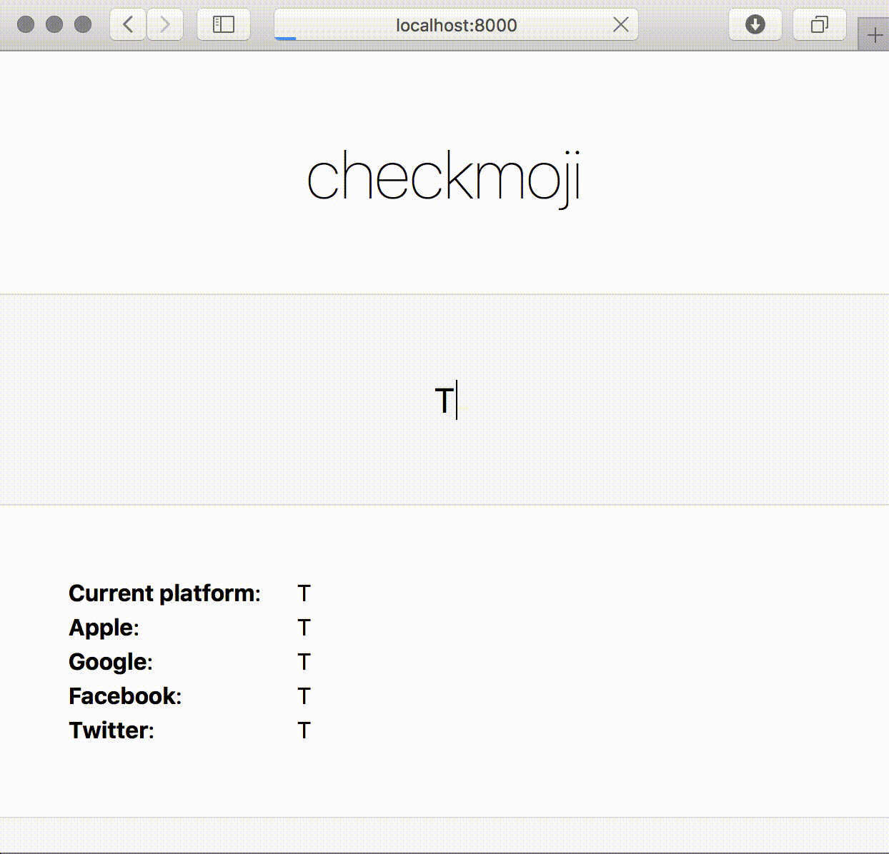

# checkmoji

## Related

*   [gemoji](http://github.com/wooorm/gemoji)
*   [write-music](http://github.com/wooorm/write-music)
*   [common-words](http://github.com/wooorm/common-words)
*   [readability](http://github.com/wooorm/readability)
*   [short-words](http://github.com/wooorm/short-words)
